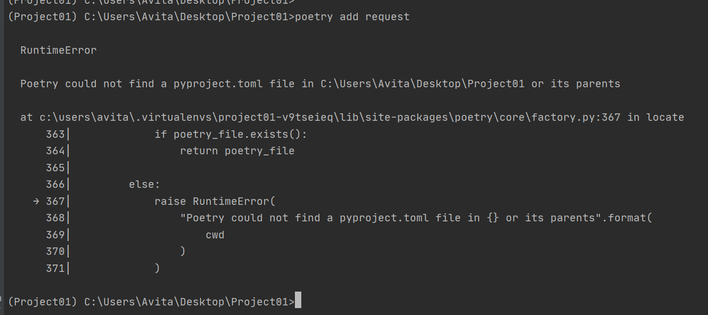

# poetry-add-errors-
Facing error-ValueError with the command 'poetry add request' in cmd prompt

I have been trying to run this command inside pycharm terminal in order to get poetry.lock written,
is there any other way to solve this issue, please do let me know if you can help.
